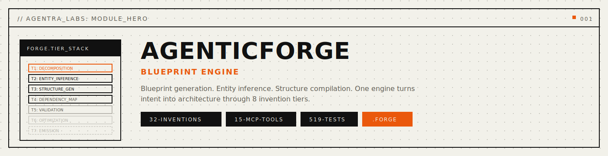

<p align="center">
  
</p>

<p align="center">
  <a href="#install"></a>
  <a href="LICENSE"></a>
  
  
  
</p>

<p align="center">
  <a href="#install">Install</a> |
  <a href="#quickstart">Quickstart</a> |
  <a href="#how-it-works">How It Works</a> |
  <a href="docs/public/mcp-tools.md">MCP Tools</a> |
  <a href="docs/public/cli-reference.md">CLI Reference</a> |
  <a href="docs/public/architecture.md">Architecture</a>
</p>

---

**AgenticForge** is a blueprint engine that designs complete project architecture
-- entities, operations, dependencies, file layout, code skeletons, wiring, and
tests -- before any code is generated. Sister #11 "The Forge" in the Agentra Labs
ecosystem.

<p align="center">
  
</p>

| Property     | Value                |
|--------------|----------------------|
| Binary       | `aforge`             |
| File format  | `.forge`             |
| Inventions   | 32 (8 tiers x 4)    |
| MCP Tools    | 15                   |
| CLI Commands | 41                   |
| Tests        | 313+                 |

## Install

### From Source (recommended)

```bash
git clone https://github.com/agentralabs/agentic-forge.git
cd agentic-forge
cargo install --path crates/agentic-forge-cli
```

### Quick Install

```bash
curl -fsSL https://agentralabs.tech/install/forge | bash
```

Profile variants:

```bash
curl -fsSL https://agentralabs.tech/install/forge/desktop | bash
curl -fsSL https://agentralabs.tech/install/forge/terminal | bash
curl -fsSL https://agentralabs.tech/install/forge/server | bash
```

### Standalone Guarantee

AgenticForge operates fully standalone. No other sister project, external
service, or orchestrator is required. Sister bridges use NoOp defaults when
running independently.

## Quickstart

```bash
# Create a blueprint
aforge blueprint create my-api --domain api --description "REST API for tasks"

# Infer entities from description
aforge entity infer <id> "Users create tasks assigned to teams"

# Resolve dependencies, generate structure, create skeletons
aforge dependency resolve <id>
aforge structure generate <id>
aforge skeleton create <id>

# Generate tests and validate
aforge test generate <id>
aforge blueprint validate <id>
```

## How It Works

AgenticForge runs a multi-tier invention pipeline:

1. **Decomposition** (Tier 1) -- Layer decomposition, concern analysis, boundary inference
2. **Entity** (Tier 2) -- Entity inference, relationship mapping, field derivation
3. **Operation** (Tier 3) -- Operation inference, signature generation, error flow design
4. **Structure** (Tier 4) -- File structure, import graph, module hierarchy
5. **Dependency** (Tier 5) -- Dependency inference, version resolution, API extraction
6. **Blueprint** (Tier 6) -- Skeleton generation, type-first materialization, contracts
7. **Integration** (Tier 7) -- Component wiring, data flow, init/shutdown sequences
8. **Test** (Tier 8) -- Test case generation, fixtures, integration plans, mocks

The output is a complete `.forge` blueprint file containing every type, function
signature, dependency, file path, and test case needed before code generation.

## MCP Server

```bash
aforge serve --mode stdio
```

Exposes 15 tools: `forge_blueprint_create`, `forge_blueprint_get`,
`forge_blueprint_update`, `forge_blueprint_validate`, `forge_blueprint_list`,
`forge_entity_add`, `forge_entity_infer`, `forge_dependency_resolve`,
`forge_dependency_add`, `forge_structure_generate`, `forge_skeleton_create`,
`forge_test_generate`, `forge_import_graph`, `forge_wiring_create`,
`forge_export`.

Compatible with any MCP client (Claude Desktop, Codex, Cursor, Windsurf, VS Code, Cline).

## Workspace

```
crates/
  agentic-forge-core/   Core library (types, engine, 32 inventions, bridges)
  agentic-forge-mcp/    MCP server (15 tools, stdio transport)
  agentic-forge-cli/    CLI binary (aforge, 41 commands)
  agentic-forge-ffi/    C FFI bindings
```

## Build & Test

```bash
cargo build --workspace
cargo test --workspace        # 313+ tests
```

## Guardrails

```bash
bash scripts/check-canonical-consistency.sh
bash scripts/check-command-surface.sh
bash scripts/check-mcp-consolidation.sh
```

## Documentation

See [docs/public/](docs/public/) for full documentation including
[quickstart](docs/public/quickstart.md),
[concepts](docs/public/concepts.md),
[CLI reference](docs/public/cli-reference.md),
[MCP tools](docs/public/mcp-tools.md),
[MCP resources](docs/public/mcp-resources.md),
[MCP prompts](docs/public/mcp-prompts.md),
[API reference](docs/public/api-reference.md),
[architecture](docs/public/architecture.md),
[configuration](docs/public/configuration.md),
[FFI reference](docs/public/ffi-reference.md),
[integration guide](docs/public/integration-guide.md),
[benchmarks](docs/public/benchmarks.md),
[FAQ](docs/public/faq.md), and
[troubleshooting](docs/public/troubleshooting.md).

## License

MIT -- see [LICENSE](LICENSE).
