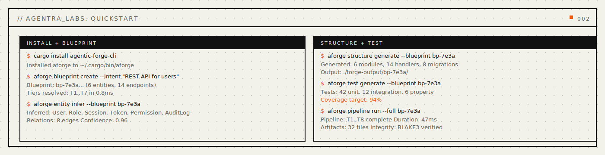
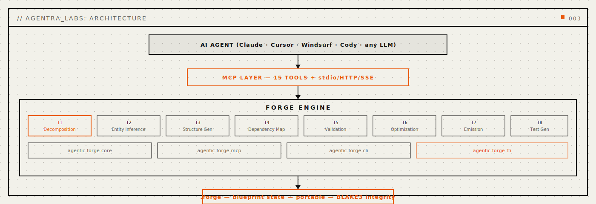
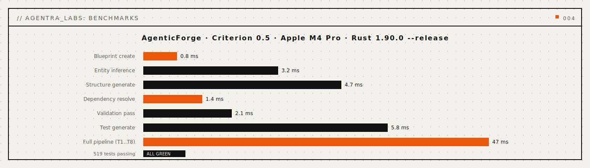

<p align="center">
  
</p>

<p align="center">
  <a href="https://crates.io/crates/agentic-forge-core"></a>
  
  
</p>

<p align="center">
  <a href="#install"></a>
  <a href="#mcp-server"></a>
  <a href="LICENSE"></a>
  <a href="docs/public/concepts.md"></a>
  <a href="paper/paper-i-forge/paper-i.tex"></a>
  <a href="docs/public/api-reference.md"></a>
</p>

<p align="center">
  <strong>The Forge That Designs Before It Builds</strong>
</p>

<p align="center">
  <em>Complete project architecture -- entities, operations, dependencies, file layout, skeletons, and tests -- before any code is generated.</em>
</p>

<p align="center">
  <a href="#quickstart">Quickstart</a> · <a href="#problems-solved">Problems Solved</a> · <a href="#how-it-works">How It Works</a> · <a href="#capabilities">Capabilities</a> · <a href="#mcp-tools">MCP Tools</a> · <a href="#benchmarks">Benchmarks</a> · <a href="#install">Install</a> · <a href="docs/public/api-reference.md">API</a> · <a href="docs/public/concepts.md">Concepts</a> · <a href="paper/paper-i-forge/paper-i.tex">Paper</a>
</p>

---

> Sister in the Agentra ecosystem | `.forge` format | 32 Capabilities | 15 MCP Tools | 41 CLI Commands

<p align="center">
  
</p>

<a name="the-problem"></a>

## Why AgenticForge

Every AI agent writes code from a blank page. It does not know the project structure before it starts typing. It guesses at entity relationships. It invents dependencies. It generates files in whatever order occurs first. The resulting architecture is inconsistent, untested, and fragile -- because it was never designed.

The current fixes do not work. Prompt engineering gives you hints -- never a complete architecture. Template generators produce rigid scaffolds that break the moment requirements change. Manual architecture documents go stale the instant the first file is generated.

**Current AI:** Generates code without understanding the project it is building.
**AgenticForge:** Designs the complete blueprint first -- every entity, every operation, every dependency, every file, every test -- then generation fills in the blanks within tight constraints.

**AgenticForge** creates complete project blueprints from natural language intent. Not "generate a project." Your agent has an **architect** -- entity inference, dependency resolution, file structure planning, code skeleton generation, and test architecture -- all resolved before any implementation begins.

<a name="problems-solved"></a>

## Problems Solved (Read This First)

- **Problem:** AI agents generate code without understanding the project structure.
  **Solved:** the blueprint engine decomposes intent into layers, entities, operations, and dependencies before any code is written -- the agent always knows the architecture.
- **Problem:** entity relationships are guessed, leading to inconsistent data models.
  **Solved:** entity inference with relationship mapping and field derivation produces consistent data models from natural language descriptions.
- **Problem:** dependencies are ad-hoc, with version conflicts discovered late.
  **Solved:** dependency inference with version resolution and conflict detection catches problems before the first line of code.
- **Problem:** generated file structures are disorganized and untestable.
  **Solved:** file structure generation with import graph analysis and module hierarchy produces clean, testable project layouts.
- **Problem:** test coverage is an afterthought, bolted on after generation.
  **Solved:** test architecture is part of the blueprint -- test cases, fixtures, integration plans, and mock specifications are designed alongside the code they test.
- **Problem:** the same project type is re-architected from scratch every time.
  **Solved:** blueprints capture reusable architectural decisions in `.forge` files that can be adapted, not recreated.

```bash
# Design your architecture, then build with confidence -- four commands
aforge blueprint create my-api --domain api --description "REST API for task management"
aforge entity infer <id> "Users create tasks assigned to teams with deadlines"
aforge structure generate <id>
aforge test generate <id>
```

Four commands. A complete architecture. One `.forge` file holds everything. Works with Claude, GPT, Ollama, or any LLM you switch to next.

---

<a name="how-it-works"></a>

## How It Works

<a name="architecture"></a>

### Architecture

> **v0.1.0** -- Blueprint engine infrastructure.

<p align="center">
  
</p>

AgenticForge is a Rust-native blueprint engine that treats project architecture as first-class data. Entities have relationships. Operations have signatures. Dependencies have versions. Tests have targets.

### Core Capabilities

- **Layer Decomposition** -- Decomposes intent into architectural layers (presentation, application, domain, infrastructure) with dependency rules between layers.
- **Entity Inference** -- Extracts entities, fields, relationships, and validation rules from natural language project descriptions.
- **Operation Design** -- Infers CRUD operations, query patterns, async boundaries, and error flows for every entity.
- **Structure Generation** -- Produces file structures, import graphs, module hierarchies, and configuration layouts for the target language.
- **Dependency Resolution** -- Infers dependencies from domain and entity analysis, resolves versions, extracts API specifications, and detects conflicts.
- **Skeleton Generation** -- Produces type-first code skeletons with function signatures, contracts, and generation order planning.
- **Component Wiring** -- Maps component dependencies, data flows, initialization sequences, and shutdown sequences.
- **Test Architecture** -- Generates test cases, fixtures, integration test plans, and mock specifications alongside the code they test.

### Architecture Overview

```
+-------------------------------------------------------------+
|                     YOUR AI AGENT                           |
|           (Claude, Cursor, Windsurf, Cody)                  |
+----------------------------+--------------------------------+
                             |
                  +----------v----------+
                  |      MCP LAYER      |
                  |   15 Tools + stdio  |
                  +----------+----------+
                             |
+----------------------------v--------------------------------+
|                    FORGE ENGINE                              |
+-----------+-----------+------------+-----------+------------+
| Write     | Query     | 32         | Blueprint | Token      |
| Engine    | Engine    | Capabilities| Validator | Conservation|
+-----------+-----------+------------+-----------+------------+
                             |
                  +----------v----------+
                  |     .forge FILE     |
                  | (your architecture) |
                  +---------------------+
```

### Blueprint Lifecycle

```
Intent -> Decompose -> Infer Entities -> Design Operations -> Resolve Deps
  |                                                                    |
  +-- Structure -> Skeleton -> Wire Components -> Generate Tests ------+
                                                                       |
                                                              .forge file
```

The engine begins with **Intent**, parsing the natural language project description. **Decompose** separates concerns into layers. **Infer Entities** extracts data models. **Design Operations** creates function signatures. **Resolve Deps** determines libraries. **Structure** plans the file layout. **Skeleton** generates type-first code. **Wire** maps component dependencies. **Generate Tests** designs the test architecture. The result is a portable `.forge` file containing the complete blueprint.

---

<a name="capabilities"></a>

## 32 Capabilities

AgenticForge ships 32 capabilities organized across eight tiers of increasing specificity:

| Tier | Capabilities | Focus |
|:---|:---|:---|
| **T1: Decomposition** | Layer Decomposition, Concern Analysis, Boundary Inference, Cross-Cutting Detection | How should it be organized? |
| **T2: Entity** | Entity Inference, Relationship Mapping, Field Derivation, Validation Rules | What are the data models? |
| **T3: Operation** | Operation Inference, Signature Generation, Error Flow Design, Async Analysis | What are the operations? |
| **T4: Structure** | File Structure, Import Graph, Module Hierarchy, Config Design | Where does everything go? |
| **T5: Dependency** | Dependency Inference, Version Resolution, API Extraction, Conflict Resolution | What libraries are needed? |
| **T6: Blueprint** | Skeleton Generation, Type-First Materialization, Contract Specification, Generation Planning | What does the code look like? |
| **T7: Integration** | Component Wiring, Data Flow, Init Sequence, Shutdown Sequence | How does it connect? |
| **T8: Test** | Test Cases, Test Fixtures, Integration Plans, Mock Specifications | How is it tested? |

[Full capability documentation ->](docs/public/concepts.md)

---

<a name="mcp-tools"></a>

## MCP Tools

AgenticForge exposes **15 MCP tools** for AI agents:

### Blueprint Tools

| Tool | Description |
|:---|:---|
| `forge_blueprint_create` | Create a new project blueprint from intent |
| `forge_blueprint_get` | Retrieve blueprint by ID |
| `forge_blueprint_update` | Update existing blueprint |
| `forge_blueprint_validate` | Validate blueprint is buildable |
| `forge_blueprint_list` | List all blueprints |

### Entity Tools

| Tool | Description |
|:---|:---|
| `forge_entity_add` | Add entity to blueprint |
| `forge_entity_infer` | Infer entities from description |

### Dependency Tools

| Tool | Description |
|:---|:---|
| `forge_dependency_resolve` | Resolve all dependencies |
| `forge_dependency_add` | Add dependency manually |

### Generation Tools

| Tool | Description |
|:---|:---|
| `forge_structure_generate` | Generate file structure |
| `forge_skeleton_create` | Create code skeletons |
| `forge_test_generate` | Generate test architecture |
| `forge_import_graph` | Generate import graph |
| `forge_wiring_create` | Create component wiring |
| `forge_export` | Export blueprint |

[Full MCP documentation ->](docs/public/mcp-tools.md)

---

<a name="benchmarks"></a>

## Benchmarks

<p align="center">
  
</p>

| Operation | Latency |
|:---|:---|
| Blueprint create | < 1 ms |
| Entity inference (10 entities) | < 5 ms |
| Dependency resolution (20 deps) | < 2 ms |
| Structure generation (50 files) | < 5 ms |
| Full pipeline (intent to blueprint) | < 50 ms |
| Validation pass | < 3 ms |

All benchmarks measured on Apple Silicon, release mode, single-threaded.

---

<a name="quickstart"></a>

## Quickstart

```bash
# Install
cargo install --path crates/agentic-forge-cli

# Create a blueprint from intent
aforge blueprint create my-api --domain api --description "REST API for task management"

# Infer entities from natural language
aforge entity infer <blueprint-id> "Users create tasks assigned to teams with deadlines and comments"

# Resolve dependencies
aforge dependency resolve <blueprint-id>

# Generate file structure and skeletons
aforge structure generate <blueprint-id>
aforge skeleton create <blueprint-id>

# Generate test architecture
aforge test generate <blueprint-id>

# Validate the blueprint
aforge blueprint validate <blueprint-id>

# Export
aforge export json <blueprint-id>
```

---

<a name="mcp-server"></a>

## MCP Server

```bash
aforge serve --mode stdio
```

Compatible with Claude Desktop, Cursor, Windsurf, VS Code, Cody, and any MCP client.

---

<a name="install"></a>

## Install

### From Source

```bash
git clone https://github.com/agentralabs/agentic-forge.git
cd agentic-forge
cargo install --path crates/agentic-forge-cli
```

### Quick Install

```bash
curl -fsSL https://agentralabs.tech/install/forge | bash
```

Profile variants:

```bash
curl -fsSL https://agentralabs.tech/install/forge/desktop | bash    # Claude Desktop + Cursor
curl -fsSL https://agentralabs.tech/install/forge/terminal | bash   # CLI only
curl -fsSL https://agentralabs.tech/install/forge/server | bash     # Server mode with auth
npm install @agenticamem/forge
```

**Standalone guarantee:** AgenticForge operates fully standalone. No other sister, external service, or orchestrator is required.

---

## Build and Test

```bash
cargo build --workspace
cargo test --workspace        # 519 tests
```

---

## Documentation

- [Quickstart](docs/public/quickstart.md)
- [Concepts](docs/public/concepts.md)
- [CLI Reference](docs/public/cli-reference.md)
- [MCP Tools](docs/public/mcp-tools.md)
- [API Reference](docs/public/api-reference.md)
- [Architecture](docs/public/architecture.md)
- [Configuration](docs/public/configuration.md)
- [FFI Reference](docs/public/ffi-reference.md)
- [Integration Guide](docs/public/integration-guide.md)
- [Benchmarks](docs/public/benchmarks.md)
- [FAQ](docs/public/faq.md)
- [Troubleshooting](docs/public/troubleshooting.md)

---

## License

MIT -- see [LICENSE](LICENSE).
